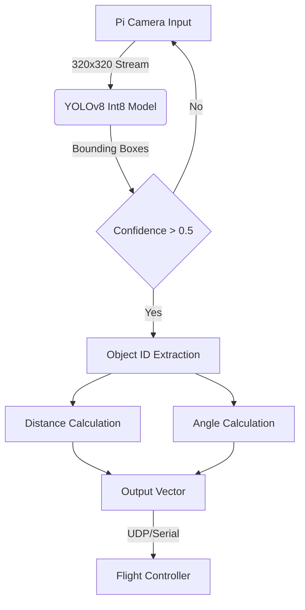

# **Defend The Republic: Autonomous Aerial Computer Vision System**

## 📖 Project Overview

This repository contains the computer vision subsystem for the **Defend The Republic (DTR)** autonomous aerial competition team at Indiana University Bloomington.

As a Junior Intelligent Systems Engineering student, my role focused on developing a **low-latency object detection and range-finding pipeline**. The system enables an autonomous blimp/drone to identify game pieces (balloons and goals), calculate their precise 3D position relative to the vehicle, and feed navigation data to the flight controller in real time.

---

## 🎯 Key Capabilities

- **Object Detection:** Identifies 8 distinct classes (Orange/Yellow Circles, Squares, Triangles; Purple/Green Balls) using a custom-trained YOLOv8 model.  
- **Edge Optimization:** Optimized for Raspberry Pi 4, achieving **180ms inference time** (down from 1s) via quantization and input scaling.  
- **3D Localization:** Algorithms compute distance (meters) and angles (θₓ, θᵧ) from 2D bounding boxes.

---

## 🛠️ Tech Stack

**Hardware:** Raspberry Pi 4 Model B, Pi Camera Module  
**ML Frameworks:** PyTorch, Ultralytics YOLOv8  
**Data Processing:** Roboflow, OpenCV  
**Techniques:** INT8 Quantization, Transfer Learning, Trigonometric Range Finding

---

## ⚙️ System Architecture

The pipeline processes video input to output navigation vectors for the flight controller.

## The Data Pipeline

**Dataset:** 2,000 manually collected and labeled images.  
**Split:** 70% Train, 20% Validation, 10% Test.  
**Augmentation:** Zoom, Rotation, and Dynamic Lighting adjustments to simulate field conditions.

---

## 🚀 Engineering Challenges & Optimizations

One of the significant challenges we faced was the hardware limitation of the **Raspberry Pi 4**.

### 1. Latency Reduction

**Initial State:**  
The standard YOLOv8 model (`640×640`, float16) resulted in a **1-second inference time**, which was too slow for autonomous flight.

**Solution:** Two-step optimization:

- **Input Scaling:** Reduced input resolution to `320×320`.  
- **Quantization:** Converted model weights from Float16 → Int8.

**Result:**  
Inference time dropped to **180 ms (~5.5 FPS)** while maintaining a high confidence threshold (`>0.73`) on game objects.

---

### 2. Distance Accuracy

We implemented a custom script to calculate focal length based on **real-world physical measurements** rather than theoretical camera specs.  
This significantly reduced distance estimation error and allowed the drone to accurately gauge approach velocity.

---

## 📊 Performance Visuals

| Model Version | Resolution        | Precision     | Inference Time (Pi 4) |
|---------------|-------------------|---------------|------------------------|
| v1 (Baseline) | 640×640           | High          | ~1000 ms               |
| v2 (Optimized)| 480×480           | High          | ~415 ms                |
| v3 (Deployed) | 320×320 (Int8)    | Medium-High   | ~180 ms                |

---
## Results
**Confusion Matrix**

## Demo

---

## Angle and Distance Demo

The field of view is 40 degrees, so the edges of the video are -20 and 20 degrees respectively.

## 👥 Team & Acknowledgements

**Defend The Republic — Computer Vision Team**

- Samson C. (Lead / Optimization)  
- Thanakin C.  
- Leah H.  
- Sam H.  
- Yoav K.  
- Jiaqi W.  

Special thanks to **Professor Or** and our mentors at **Indiana University Bloomington** for their guidance in hardware integration.

---

## 📬 Contact

**Your Name**  
Junior, Intelligent Systems Engineering @ IU Bloomington  

**LinkedIn:** www.linkedin.com/in/samson-connelly-03811330b  
**Email:** sbconnelly2000@gmail.com  

Looking for **Summer 2026 Internship** opportunities in Embedded Systems, Computer Vision, or Robotics.
